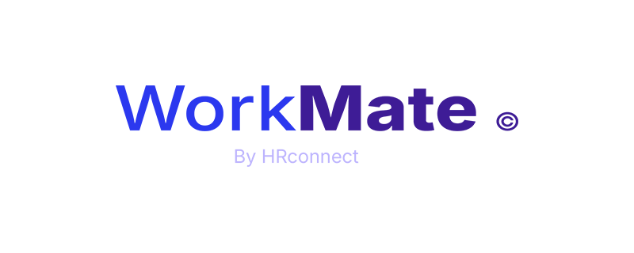

<p align="center">
  
</p>

<h1 align="center">
WorkMate 💼
</h1>

<p align="center">
WorkMate is a professional workspace and HR management mobile application designed to bridge the gap between HR departments and employees. Built with Flutter, it provides a seamless experience for managing payroll, leave requests, expenses, and employee profiles in one centralized location.
</p>

[](https://flutter.dev)
[](https://dart.dev)
[](https://blog.cleancoder.com/uncle-bob/2012/08/13/the-clean-architecture.html)

---

## 📌 Project Status

🚧 Currently under active development.

Implemented modules include:

- Authentication
- Employee Profile
- Payroll
- Expenses
- Office Assets

Upcoming modules:

- Attendance
- Leave Requests
- Tasks
- Notifications

## 🚀 Roadmap

- [x] Authentication
- [x] Expense Module
- [x] Payroll
- [x] Employee Profile
- [x] Office Assets
- [ ] Attendance
- [ ] Leave Requests
- [ ] Push Notifications
- [ ] Dark Theme
- [ ] Unit Testing


## ✨ Key Features

- **🔐 Secure Authentication**: Multi-factor authentication support with secure token management.
- **📊 Employee Dashboard**: At-a-glance view of tasks, announcements, and quick actions.
- **👤 Profile Management**: Detailed employee profiles including personal info, documents, and office assets.
- **🌴 Leave Management**: Streamlined process for requesting and approving leave applications.
- **💰 Expense Tracking**: Easy submission and tracking of business expenses with receipt uploads.
- **💸 Payroll & Payslips**: Secure access to monthly payslips and payroll history.
- **📂 Department Overview**: Organizational structure and department-specific information.

## ⭐ Highlights

- Clean Architecture
- Feature-first project structure
- Generic API response parsing
- Generic exception handling
- Functional error handling using Either (fpdart)
- Custom Failure & Exception system
- Dependency Injection with GetIt
- Secure token storage
- Environment-based configuration
- Reusable Design System
- PDF Export Service
- Centralized Navigation using GoRouter
- Production-ready Dio networking layer

## 🛠 Tech Stack
| Category               | Technology                                                                |
| ---------------------- |---------------------------------------------------------------------------|
| Framework              | [Flutter](https://flutter.dev)                                            |
| Language               | Dart                                                                      |
| Architecture           | Clean Architecture                                                        |
| State Management       | [BLoC (flutter_bloc)](https://pub.dev/packages/flutter_bloc)              |
| Functional Programming | [fpdart](https://pub.dev/packages/fpdart)                                 |
| Routing                | [GoRouter](https://pub.dev/packages/go_router)                            |
| Networking             | [Dio](https://pub.dev/packages/dio)                                       |
| Dependency Injection   | [GetIt](https://pub.dev/packages/get_it)                                  |
| Secure Storage         | [Flutter Secure Storage](https://pub.dev/packages/flutter_secure_storage) |
| Local Storage          | [Shared Preferences](https://pub.dev/packages/shared_preferences)         |
| Localization           | [Easy Localization](https://pub.dev/packages/easy_localization)           |
| Logging                | [Logger](https://pub.dev/packages/logger)                                 |
| Backend                | Laravel REST API                                                          |


## 🏗 Architecture

The project follows **Clean Architecture** principles combined with **Feature-driven Layering**:
```text
lib/
├── core/             # Core utilities, theme, network config, error handling
├── features/         # Feature-based modules
│   ├── auth/         # Login and authentication logic
│   ├── home/         # Dashboard and landing features
│   ├── leave/        # Leave management logic
│   ├── expense/      # Expense tracking logic
│   └── profile/      # User profile, payroll, and office assets
└── main.dart         # Entry point and app configuration
```
## 🌐 Backend

The mobile application communicates with a RESTful backend built with Laravel.
Authentication is handled using secure token-based authentication, and all communication is performed through a centralized Dio networking layer.

## 🎨 Design System

The application uses a custom design system including

- Custom Color Scheme
- Typography
- Theme Extensions
- Reusable Components
- Material 3

## 🚀 Getting Started

### Prerequisites

- Flutter SDK: `^3.10.1`
- Dart SDK: `^3.10.1`
- Android Studio / VS Code with Flutter extensions

### Installation

1. **Clone the repository**
   ```bash
   git clone https://github.com/yourusername/workmate.git
   cd workmate
   ```

2. **Install dependencies**
   ```bash
   flutter pub get
   ```

3. **Environment Configuration**
   Copy the example environment file and fill in your details:
   ```bash
   cp .env.example .env
   ```
   Edit `.env` and provide your `API_BASE_URL` and `X_API_KEY`.

4. **Run the application**
   ```bash
   flutter run
   ```

## 📝 Environment Variables

The app uses `flutter_dotenv` for configuration. Ensure the following keys are set in your `.env` file:

| Key | Description |
|---|---|
| `API_BASE_URL` | The base URL for the backend API |
| `X_API_KEY` | API Key for header authentication |
| `APP_NAME` | The display name of the app (default: WorkMate) |
| `ENV` | Current environment (development/production) |

## 📸 Screenshots


---

## 🤝 Contributing

Contributions are welcome! Please feel free to submit a Pull Request.

1. Fork the Project
2. Create your Feature Branch (`git checkout -b feature/AmazingFeature`)
3. Commit your Changes (`git commit -m 'Add some AmazingFeature'`)
4. Push to the Branch (`git push origin feature/AmazingFeature`)
5. Open a Pull Request

## 📄 License

Distributed under the MIT License. See `LICENSE` for more information.

---
Developed with ❤️ by the WorkMate Team.
If you found this project helpful, consider giving it a ⭐.
